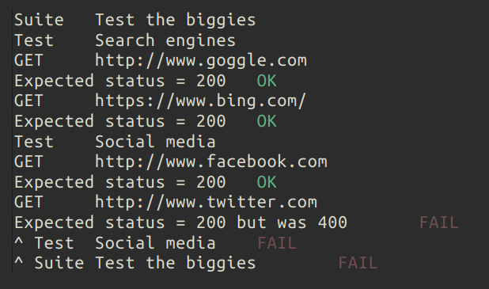

# Dratt - Deno REST API test tool
## Use Dratt to test REST APIs.
1. Specify you request
2. Tell dratt what you expect to find in the response.
3. Run dratt and see the magic happen.

## HOW!?
Create a typescript file that are the entry point of your test.

Name it `test.ts` and paste this snippet:

```ts
import {
  dratt,
  ExpectStatus,
  LogLevel,
  Test,
  TestSuite,
} from "https://raw.githubusercontent.com/christoffersh/dratt/dev/dratt.ts";

await dratt({ logLevel: LogLevel.Info }).run$(
  TestSuite("Test the biggies").tests(
    Test("Search engines")
      .get("http://www.goggle.com", [ExpectStatus.toBe(200)])
      .get("https://www.bing.com/", [ExpectStatus.toBe(200)]),
    Test("Social media")
      .get("http://www.facebook.com", [ExpectStatus.toBe(200)])
      .get("http://www.twitter.com", [ExpectStatus.toBe(200)]),
  ),
);

```

Run it with [deno](https://deno.land/) like this:
```bash
deno run --allow-net main.ts
```

You will see something like this:

</img>

Dratt runs the test and checks the expectectations.</br>
If an expectation fails, the test is stopped. The test suite continues despite failed tests.

## What about JSON in request and response?
